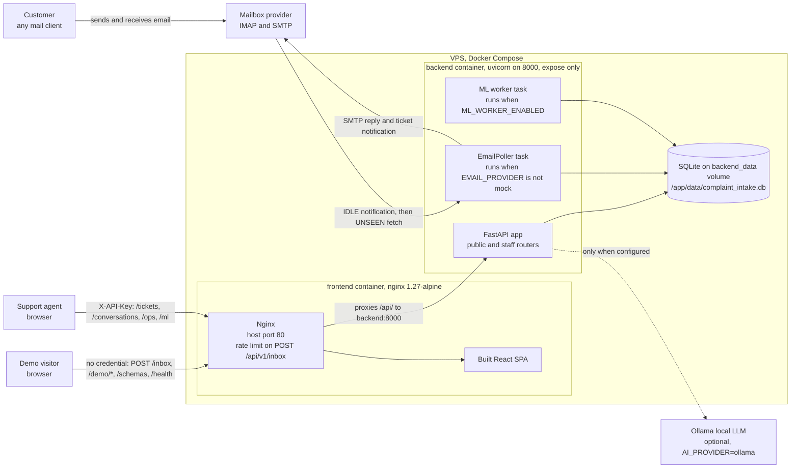

# System context and containers

**Scope.** Who uses the system, what runs where, and which external services it
depends on. One level above the code: no classes, no functions.

**Read it** first, or when you need to know what is deployed and what talks to
what.

Sources: `compose.yml`, `frontend/nginx.conf`, `backend/Dockerfile`,
`frontend/Dockerfile`, `backend/app/main.py`, `backend/app/core/config.py`.

Notes taken from the configuration, not assumed:

- The backend port is never published to the host. Only Nginx is, on port 80.
- Both background tasks are started in `lifespan()` in the same process as the
  API, not as separate services.
- With the default `EMAIL_PROVIDER=mock` no mailbox is involved and the poller
  is not started at all.
