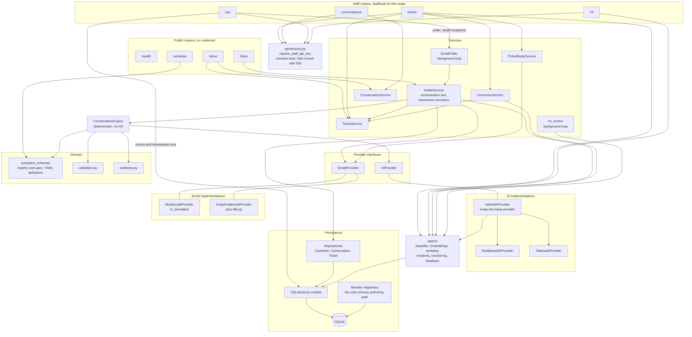

# Backend and service architecture

**Scope.** The modules inside `backend/app`, and which way their dependencies
point. Routes at the top, storage at the bottom, interfaces in between.

**Read it** when you need to find where a responsibility lives, or before
adding a route or a service.

Sources: `app/api/routes/*`, `app/api/security.py`, `app/services/*`,
`app/conversation/engine.py`, `app/ai/*`, `app/email/*`, `app/repositories/*`,
`app/domain/*`.

Notes taken from the code:

- `ConversationEngine` imports `AIProvider` and the schema registry only. It
  performs no I/O and holds no session, which is why the same engine serves the
  demo endpoint and the mail poller.
- `HybridAIProvider` is built by `app/ai/factory.py` and wraps whichever base
  provider is configured. It overrides `classify` and delegates everything else.
- Staff authentication is declared on the router, so a new staff route inherits
  it by default. `tests/test_route_authorization_contract.py` fails if a route
  is missing from the policy.
