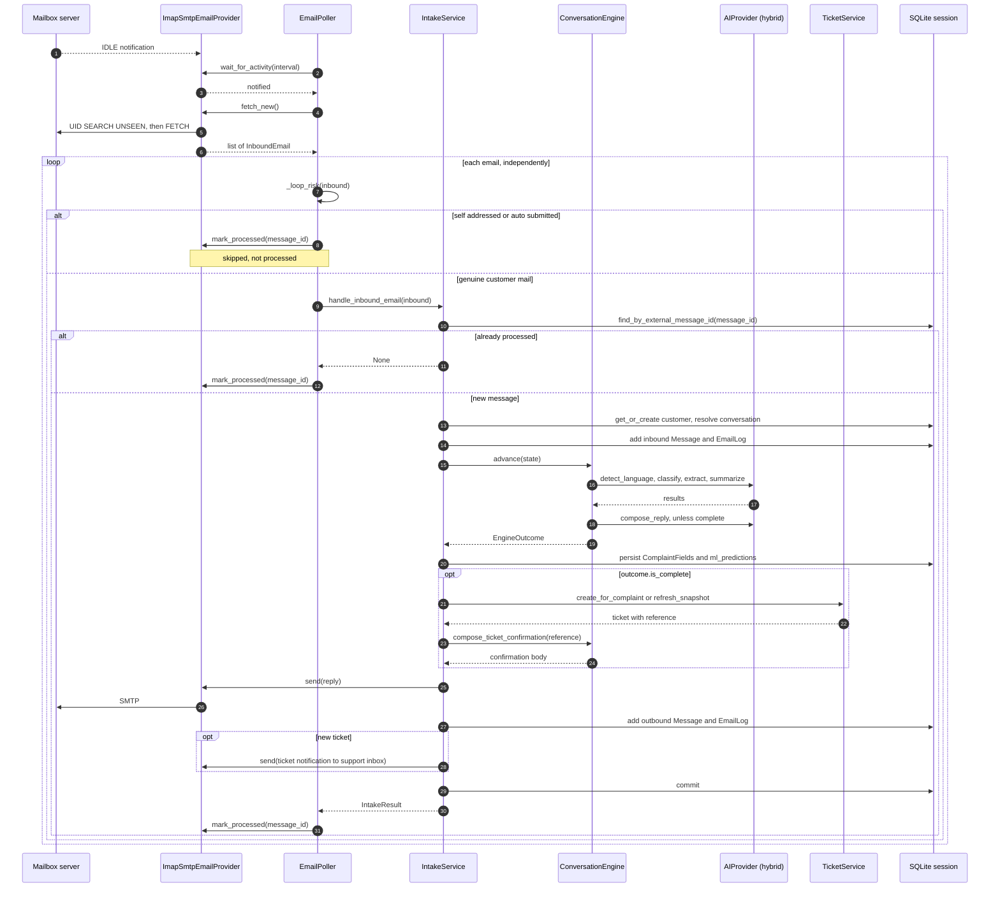

# Email intake sequence

**Scope.** One inbound customer email, from the IMAP notification to the point
where the message is acknowledged on the server. Ordering is the subject here.

**Read it** when changing anything in the poller or in `IntakeService`, or when
reasoning about crash safety and retries.

Sources: `app/services/email_poller.py`, `app/services/intake_service.py`,
`app/email/idle.py`, `app/email/providers/imap_smtp.py`,
`app/services/ticket_service.py`.

The ordering that matters, all of it visible above:

- The reply is sent **inside** the transaction, before `commit`. A provider
  failure rolls the whole turn back, so the system never advances a
  conversation without the customer being asked.
- The message is acknowledged on the server **after** the commit. A crash in
  between leaves it unread, so the next poll retries it, and the idempotency
  check at the top absorbs the duplicate.
- Each email gets its own session, so one failure cannot affect another.
- A failure inside `handle_inbound_email` skips `mark_processed` entirely: the
  email stays in the mailbox.
