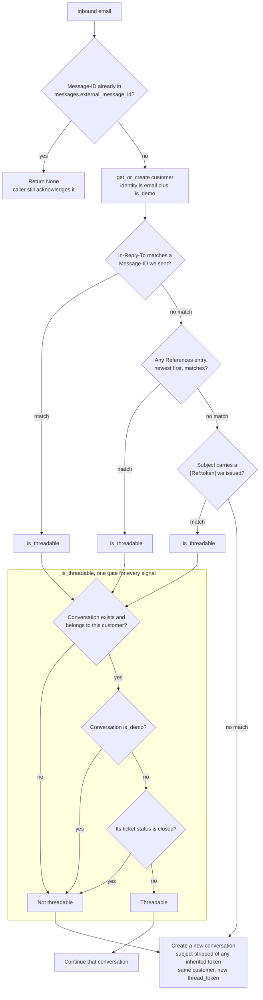

# Thread resolution and idempotency

**Scope.** How an inbound email is matched to an existing conversation, and
what disqualifies a match. Covers the idempotency check that runs first.

**Read it** before touching threading, the demo boundary, or closed-ticket
behaviour. Related decision record: [ADR-007](../adr/007-threading-and-idempotency.md).

Sources: `app/services/intake_service.py` (`handle_inbound_email`,
`_resolve_conversation`, `_is_threadable`), `app/services/email_threading.py`,
`app/db/models/message.py`, `app/db/models/conversation.py`.

Why it is shaped this way, from the code and its comments:

- The sender address is never a threading signal on its own. One customer may
  have several complaints open at once.
- Every signal passes through the same gate, so the rules hold however the
  match was made rather than depending on each call site.
- Real email never joins a demo conversation, and the public demo endpoint
  refuses to continue a non-demo one, so the two sets stay separate in both
  directions.
- A closed ticket is never reopened. The lifecycle outranks the email headers,
  and the customer keeps their identity while the thread starts fresh.
