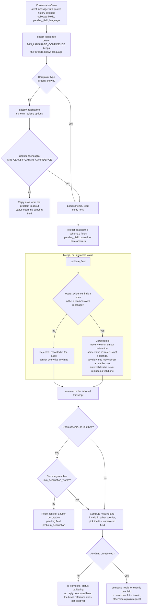

# Conversation engine turn

**Scope.** What happens inside `ConversationEngine.advance()` for one customer
message. No persistence, no email, no network: the engine is pure.

**Read it** when changing classification, extraction, validation, or the rule
that only one field is asked for per message.

Sources: `app/conversation/engine.py`, `app/conversation/state.py`,
`app/domain/validation.py`, `app/domain/evidence.py`,
`app/domain/complaint_schemas/spec.py`.

Properties the shape enforces:

- The engine never branches on a field's value. It asks the schema which fields
  are required and collects them, so the deposit method is free text that
  unlocks nothing.
- An invalid answer outranks a later merely-missing field, so the conversation
  never advances past a value it has already rejected.
- The evidence gate applies to whatever provider is configured, including a
  future language model. `EXTRACTION_REQUIRE_EVIDENCE` controls it.
- Completion composes no reply. `IntakeService` calls
  `compose_ticket_confirmation` after the ticket actually exists, so the
  reference is real rather than invented.
