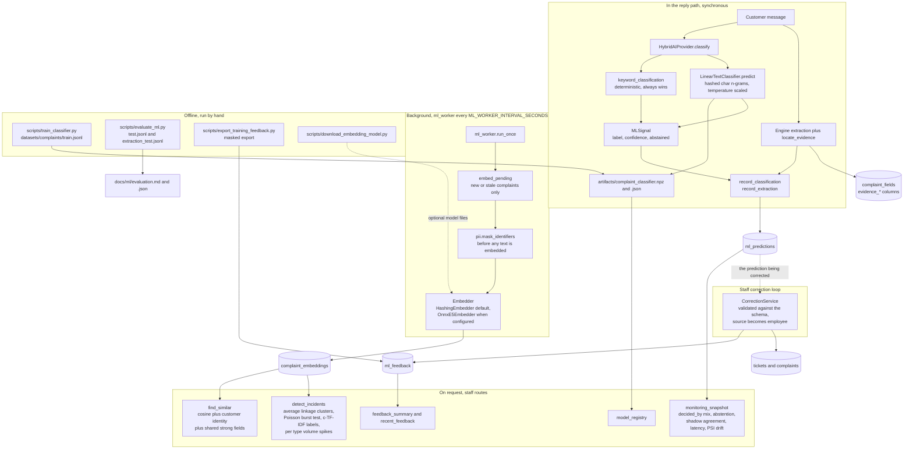

# ML architecture and data flow

**Scope.** Every statistical component, split by when it runs: in the reply
path, in the background, on request from the dashboard, or offline. Also shows
what each one writes.

**Read it** when changing anything under `app/ml`, and to confirm that no ML
path mutates a ticket on its own. Related decision record:
[ADR-009](../adr/009-ml-assists-the-deterministic-engine.md). Narrative:
[docs/ml.md](../ml.md).

Sources: `app/ml/*`, `app/ai/providers/hybrid.py`, `app/services/ml_worker.py`,
`app/services/correction_service.py`, `app/api/routes/ml.py`,
`app/api/routes/tickets.py`, `backend/scripts/*`.

Boundaries the code actually enforces:

- Keyword rules outrank the classifier. The model is consulted only where the
  rules found nothing, and only above its calibrated threshold.
- `ML_CLASSIFIER_MODE=shadow` records the model's opinion and returns the base
  provider's answer, which is how shadow agreement is measured on live traffic.
  `off` removes the model entirely.
- Similarity and incidents produce suggestions. Nothing under `app/ml` merges,
  closes, reprioritises, or sends mail.
- `ml_predictions` stores labels, scores and timings only, never message text
  or addresses.
- A correction is applied as a staff decision and recorded. No model retrains
  itself; `train_classifier.py` is a deliberate, committed step.
