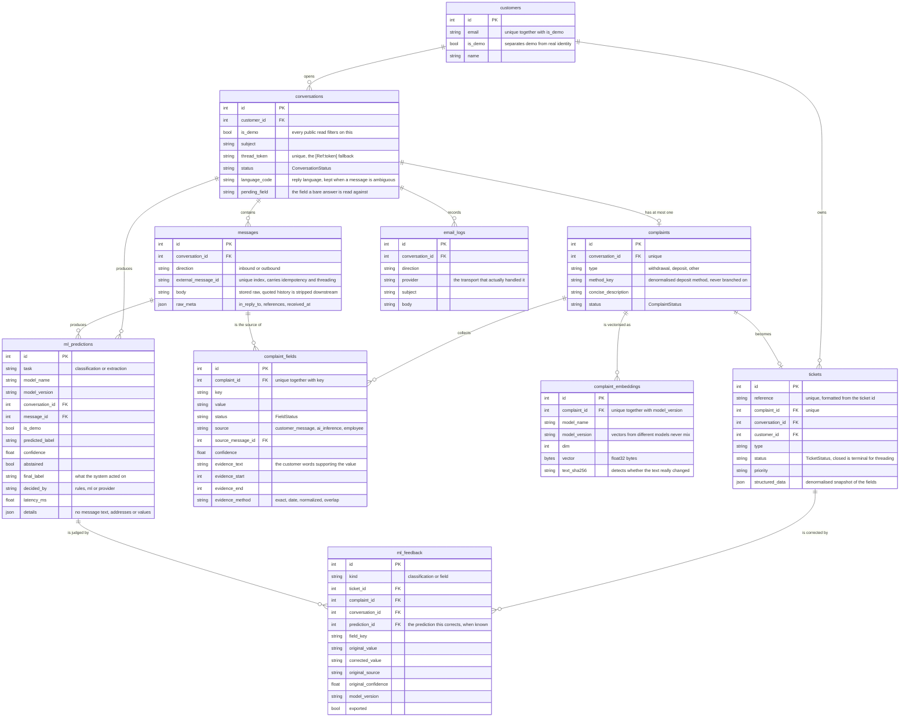

# Data model

**Scope.** Every table, its foreign keys, and the columns that carry a rule.
Only columns worth explaining are listed; the models are the full reference.

**Read it** before writing a query or a migration. The schema is authored only
by Alembic, never by `create_all()`.

Sources: `app/db/models/*.py`, `alembic/versions/*.py`.

Constraints that carry behaviour rather than tidiness:

- `messages.external_message_id` is uniquely indexed. That single index is what
  makes redelivery harmless, since a duplicate cannot create a second
  conversation, question, or ticket.
- `customers` is unique on `(email, is_demo)`, so a demo visitor claiming a real
  customer's address gets a separate row.
- `conversations.thread_token` is unique and is the fallback when a provider
  rewrites Message-IDs in transit.
- `complaint_fields` is unique on `(complaint_id, key)`, so a field has exactly
  one current value with its evidence.
- `complaint_embeddings` is unique on `(complaint_id, model_version)`, so
  switching embedder adds vectors rather than corrupting the space.
- Ten migrations build this, ending at `8883faf476b6`. Every one uses batch
  mode, which is what makes an ALTER safe on SQLite.
