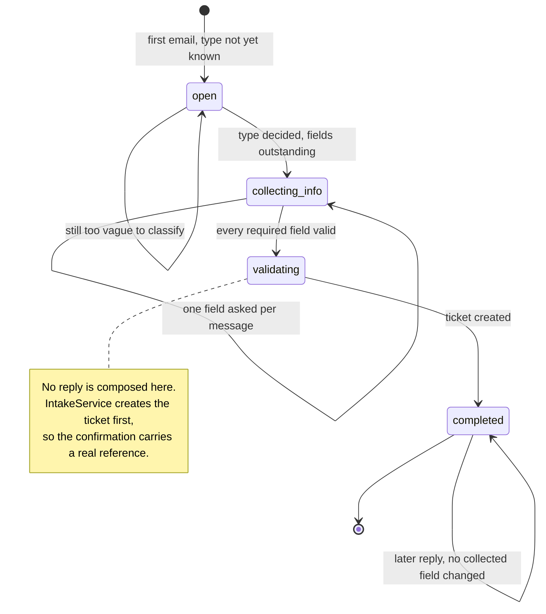
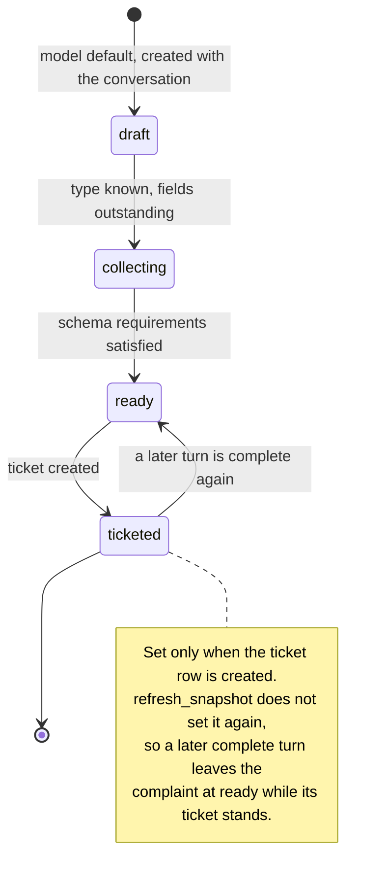
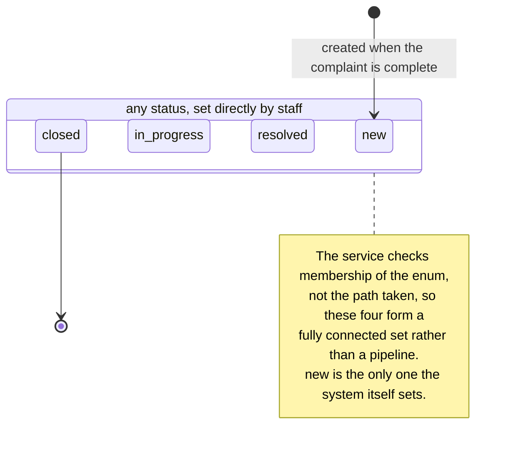

# Conversation, complaint and ticket lifecycle

**Scope.** The three status enums, what moves each one, and how they interact
when support closes a ticket.

**Read it** when changing status handling, or to see why a reply to a closed
thread starts something new.

Sources: `app/domain/enums.py`, `app/services/intake_service.py`,
`app/services/ticket_service.py`, `app/api/routes/tickets.py`.

## Conversation

Re-derived every turn: `_run_turn` assigns whatever the engine's outcome says,
and `_finalize` overrides it with `completed` once a ticket exists. The path
below is the ordinary one rather than a restriction the code enforces.

`abandoned` exists in `ConversationStatus` and no code path sets it.

## Complaint

Written in two places only: `IntakeService._run_turn` sets `collecting` and
`ready`, and `TicketService.create_for_complaint` sets `ticketed`.

## Ticket

Staff owned. `PATCH /tickets/{reference}` is the only writer, and it validates
the value against `TicketStatus` without restricting which transition is
allowed, so any status can follow any other.

`closed` is terminal for threading rather than for editing: a later customer
email is refused by `_is_threadable` and starts a new conversation with its own
ticket, and the closed ticket is never appended to. Staff can still move the
status afterwards.

How they meet:

- The ticket reference comes from the database's own autoincrementing key, so
  it is unique by construction and no model can invent it.
- A later reply to a completed conversation produces a new confirmation only if
  the engine actually changed a collected field that turn. Support is notified
  once, when the ticket is created.
- Staff owned fields, status and priority, are never overwritten when the
  ticket's denormalised snapshot is refreshed after a correction.
