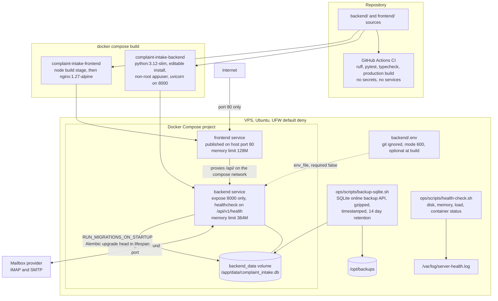

# Production deployment

**Scope.** What is built, what runs on the host, and what surrounds it:
migrations on startup, backups, health logging, and CI. Values specific to the
live deployment are deliberately absent.

**Read it** before a deploy, or when tracing how a commit becomes a running
container. Procedure: [DEPLOYMENT.md](../../DEPLOYMENT.md). Host notes:
[SERVER.md](../../SERVER.md).

Sources: `compose.yml`, `backend/Dockerfile`, `frontend/Dockerfile`,
`frontend/nginx.conf`, `ops/scripts/*`, `.github/workflows/ci.yml`,
`backend/app/core/migrations.py`.

Facts worth keeping straight:

- There is no `environment:` block in `compose.yml`, deliberately. Compose gives
  it higher precedence than `env_file`, which would let defaults written there
  override a real deployment's `backend/.env`.
- `backend/.env` is declared `required: false`, so a fresh clone starts with the
  application's own demo-safe defaults: mock email, rule-based AI, no mailbox.
- Migrations run inside the container at startup, so a deploy is build, up, and
  the schema follows the code.
- The two ops scripts are cron-driven on the host. The schedule and crontab live
  on the server, not in this repository, so they are shown here as scripts
  rather than as a scheduler.
- Nothing in this repository configures TLS, DKIM, or DMARC.
