# Architecture diagrams

Nine diagrams of the system as it is built, drawn from the code rather than
from intention. Every diagram is shown in full on this page; each one also has
its own file with the sources it was drawn from and the notes that go with it.

| # | Diagram | Read it when |
|---|---|---|
| 01 | [System context and containers](#1-system-context-and-containers) | You are new to the project, or need to know what is deployed |
| 02 | [Backend and service architecture](#2-backend-and-service-architecture) | Finding where a responsibility lives, or adding a route or service |
| 03 | [Email intake sequence](#3-email-intake-sequence) | Changing the poller or `IntakeService`, or reasoning about retries and crash safety |
| 04 | [Thread resolution and idempotency](#4-thread-resolution-and-idempotency) | Touching threading, the demo boundary, or closed-ticket behaviour |
| 05 | [Conversation engine turn](#5-conversation-engine-turn) | Changing business logic, validation, or what the customer is asked next |
| 06 | [ML architecture and data flow](#6-ml-architecture-and-data-flow) | Changing anything under `app/ml`, or checking that ML cannot mutate a ticket |
| 07 | [Data model](#7-data-model) | Writing a query or a migration |
| 08 | [Conversation, complaint and ticket lifecycle](#8-conversation-complaint-and-ticket-lifecycle) | Changing status handling |
| 09 | [Production deployment](#9-production-deployment) | Before a deploy, or tracing how a commit becomes a container |

Start with 1 for the shape of the system, then 3 to see a real email move
through it. 2 tells you where the code is. After that read whichever of 4 to 9
matches what you are about to change.

## 1. System context and containers

Who uses the system, what runs where, and which external services it depends on.

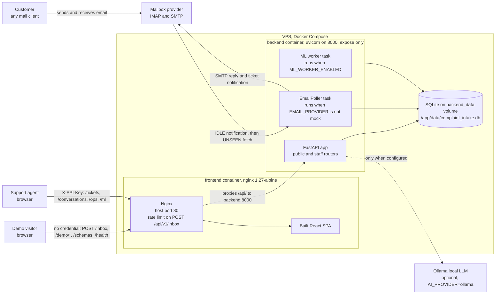

Detail and sources: [01-system-context.md](01-system-context.md).

## 2. Backend and service architecture

The modules inside `backend/app`, and which way their dependencies point.

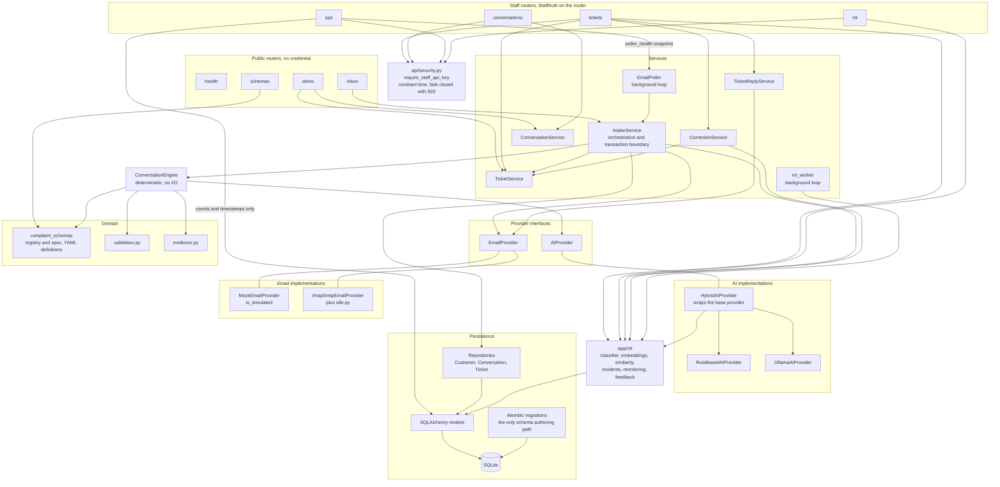

Detail and sources: [02-backend-architecture.md](02-backend-architecture.md).

## 3. Email intake sequence

One inbound email, from the IMAP notification to the acknowledgement on the server.

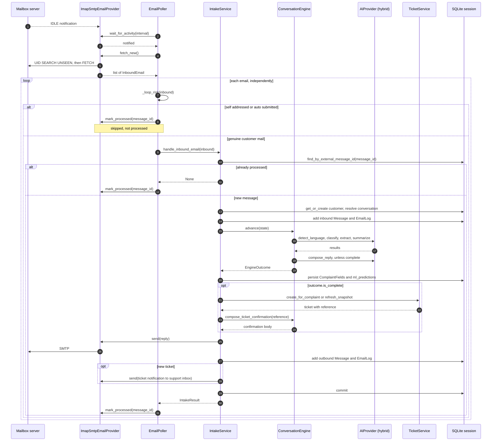

Detail and sources: [03-email-intake-sequence.md](03-email-intake-sequence.md).

## 4. Thread resolution and idempotency

How a reply is matched to a conversation, and what disqualifies a match.

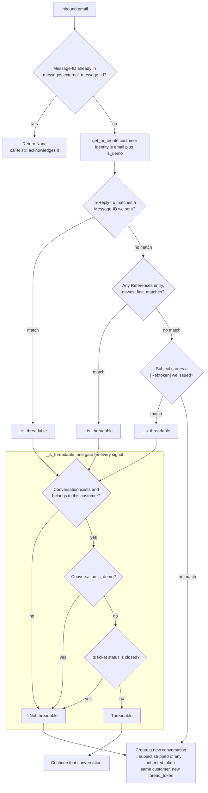

Detail and sources: [04-thread-resolution.md](04-thread-resolution.md).

## 5. Conversation engine turn

Inside `ConversationEngine.advance()` for one message. No persistence, no email, no network.

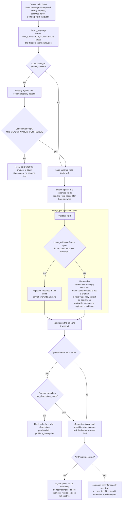

Detail and sources: [05-conversation-engine.md](05-conversation-engine.md).

## 6. ML architecture and data flow

Every statistical component, split by when it runs, and what each one writes.

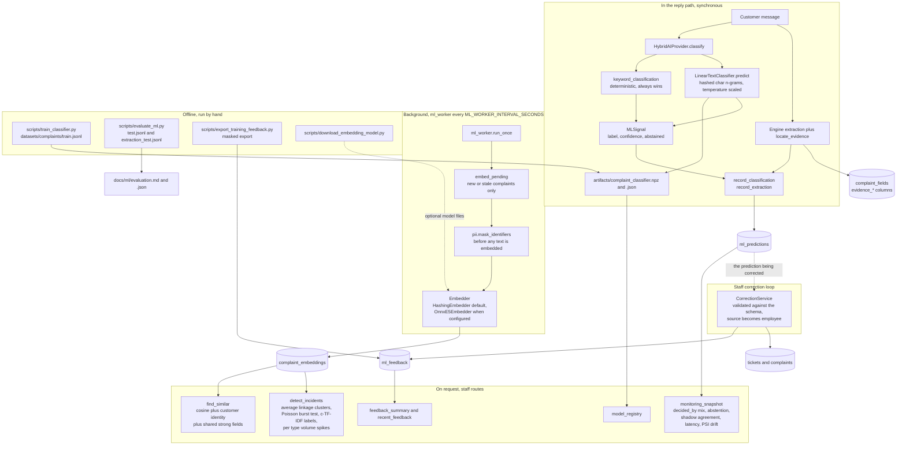

Detail and sources: [06-ml-architecture.md](06-ml-architecture.md).

## 7. Data model

Every table, its foreign keys, and the columns that carry a rule.

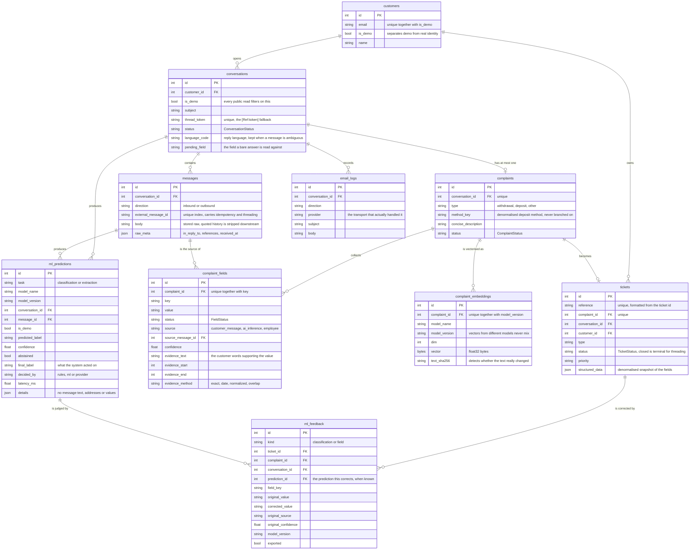

Detail and sources: [07-data-model.md](07-data-model.md).

## 8. Conversation, complaint and ticket lifecycle

The three status enums, what moves each one, and how they interact.

**Conversation**

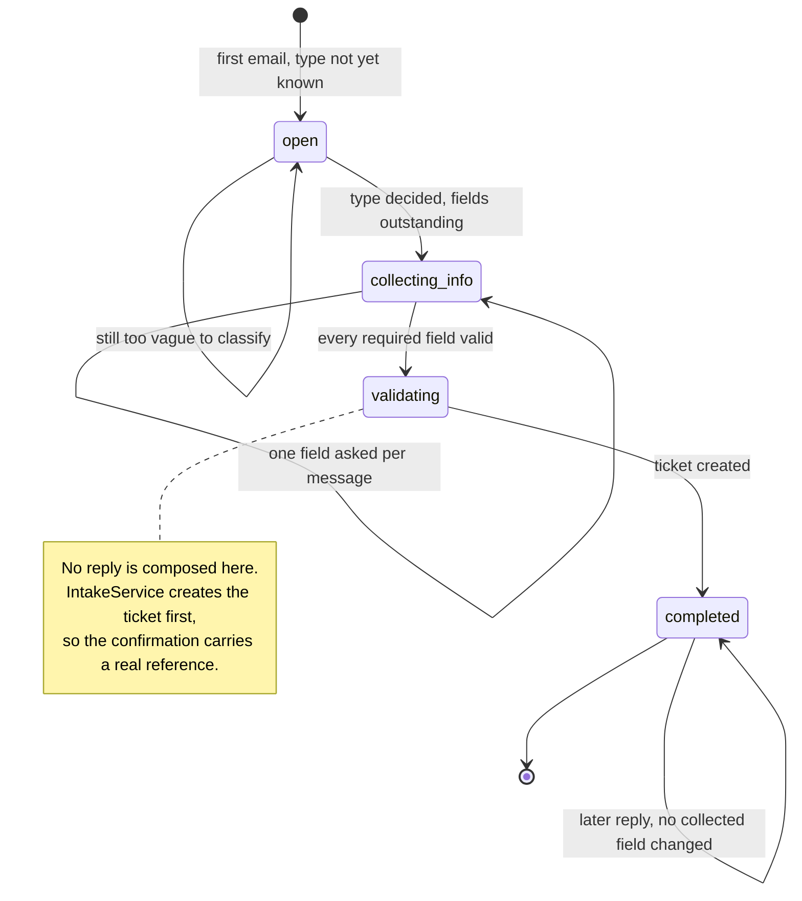

**Complaint**

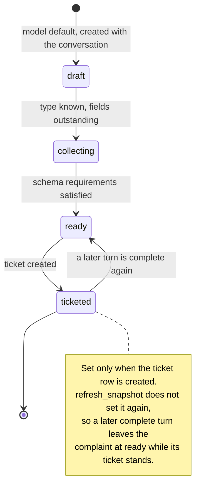

**Ticket**

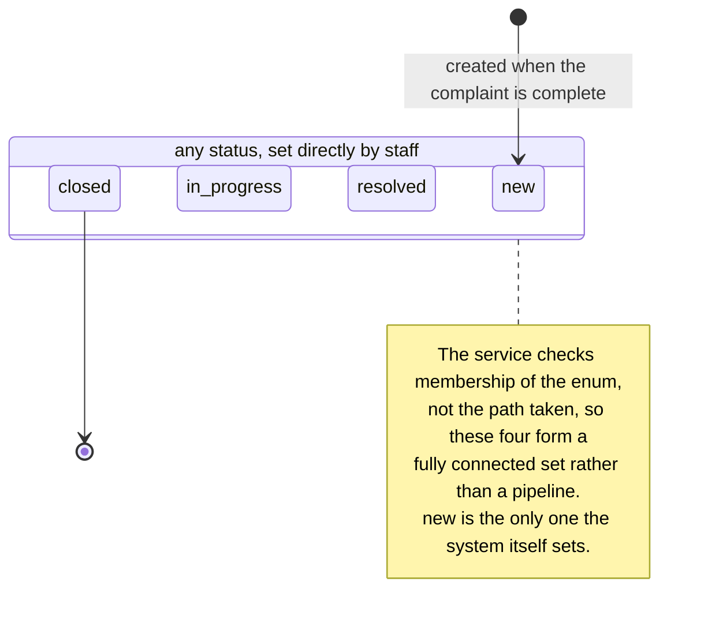

Detail and sources: [08-lifecycle.md](08-lifecycle.md).

## 9. Production deployment

What is built, what runs on the host, and what surrounds it.

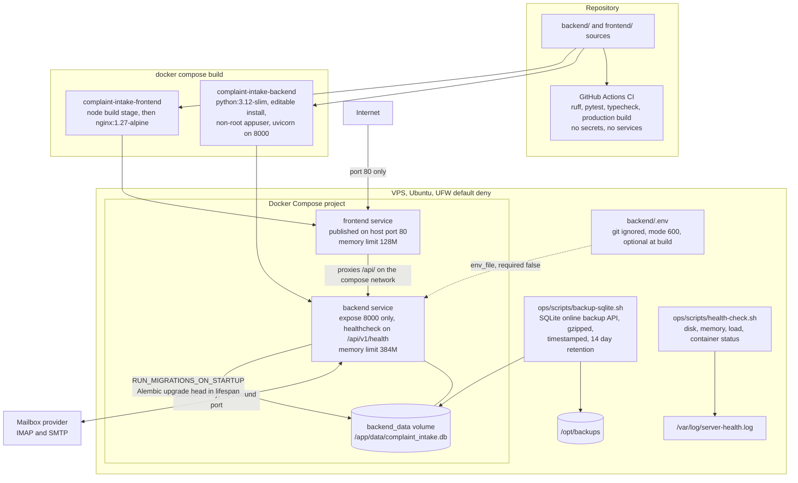

Detail and sources: [09-deployment.md](09-deployment.md).

## Where the prose lives

These diagrams are a companion to the written documentation, not a replacement:

- [docs/architecture.md](../architecture.md) is the component-level reference.
- [docs/ml.md](../ml.md) explains the ML layer in narrative form.
- [docs/adr/](../adr/) records why each significant decision was taken.

## Keeping them honest

A diagram that drifts is worse than none. When you change a component name, a
route, a table, or a status, update the diagram in the same commit. Each
diagram file lists the sources it was drawn from, so checking one is a matter
of rereading those files.

This page repeats the Mermaid source held in those files so that everything is
visible in one place. Edit the diagram file first, then copy the block here, and
the two stay identical.
